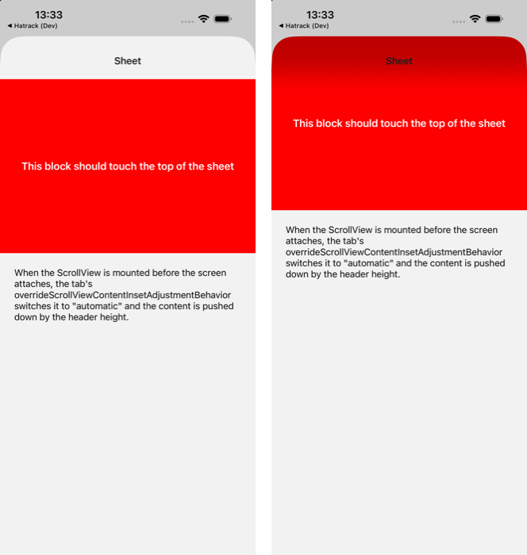

# react-native-screens: tab inset override leaks into form sheets

Minimal repro for a react-native-screens (4.26.x, same code in 4.28.0) iOS bug.

`RNSTabsScreen`'s `overrideScrollViewContentInsetAdjustmentBehavior` (on by default) also reaches screens presented modally from a stack inside the tab, and screens in a stack nested in that modal. When such a screen attaches, the first `ScrollView` in its first-descendant chain is switched from `never` to `automatic`. With a transparent header the content is then pushed down by the header height.

The override only runs when the screen attaches, so the result depends on whether the `ScrollView` is already mounted at that moment.



## Run

```sh
npm install
npx expo run:ios
```

## Steps

1. Tap **Open (ScrollView on first frame)**. The red block starts one header height below the top of the sheet.
2. Swipe the sheet down to close it.
3. Tap **Open (ScrollView after 300ms)**. The red block starts at the top of the sheet, under the transparent header.

Both buttons open the same screen (`app/(home)/sheet/index.tsx`). The only difference is whether the `ScrollView` renders on the first frame.
